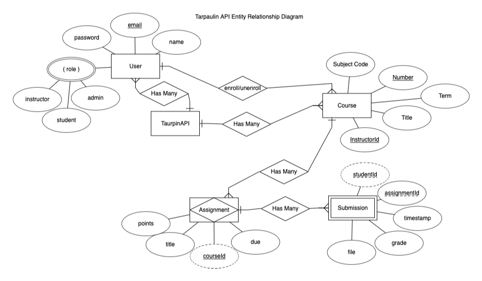

<div align="center">
  
</div>

# CS493 Final Project Team 1

<!-- [](https://classroom.github.com/open-in-codespaces?assignment_repo_id=11175781)
<a href="https://classroom.github.com/open-in-codespaces?assignment_repo_id=11175781" target="_blank"></a> -->

## Team Members

- [Tom Nyuma](@Nyumat)
- [Jeff Huang](@solderq35)
- [Artem Kolpakov](@artkolpakov)
- [Alaric Hartsock](@alarichartsock)

## Project Description

For our final project, we're building an API from scratch. The API we'll be building is Tarpaulin, a lightweight course management tool that’s an “alternative” to Canvas.  In particular, Tarpaulin allows users (instructors and students) to see information about the courses they’re teaching/taking.  It allows instructors to create assignments for their courses, and it allows students to submit solutions to those assignments.

## Getting Started

### Prerequisites

Before getting started with developing or testing Tarpaulin, you'll need to install the following:

- [Docker](https://www.docker.com/)
- [Docker Compose](https://docs.docker.com/compose/)
- [Node.js](https://nodejs.org/en/)
- [NPM](https://www.npmjs.com/)
- [Insomnia](https://insomnia.rest/)
- [MongoDB](https://www.mongodb.com/)

### Installation

1. Clone the repo

   ```sh
   git clone https://github.com/osu-cs493-sp23/DreamTeamDB.git
    ```

2. Install NPM packages

    ```sh
    cd DreamTeamDB && npm install
    ```

4. Run MongoDB container:

  ```sh
  make docker-start
  make mongo-run
  ```

5. Set up Mongo DB:

  ```sh
  make mongo-attach
  mongosh --username root --password pass --authenticationDatabase admin
  use tarpaulin
  db.createUser({ user: "tarpaulin", pwd: "pass", roles: [ { role: "readWrite", db: "tarpaulin" } ] });
  ```

6. Start the server (dev)

    ```sh
    npm run dev 
    ```

  **Note:** If you're using the Docker Compose YAML, you can start the services with `docker-compose up`.

- [OpenAPI Spec](./openapi.yaml)
- [Swagger.io](https://editor.swagger.io/)

## Tech Stack

- [Node.js](https://nodejs.org/en/)
- [Express](https://expressjs.com/)
- [MongoDB](https://www.mongodb.com/)
- [Redis](https://redis.io/)
- [JsonWebToken](https://www.npmjs.com/package/jsonwebtoken)
- [Joi](https://www.npmjs.com/package/joi)
- [Bcrypt](https://www.npmjs.com/package/bcrypt)
- [Insomnia](https://insomnia.rest/)
- [Docker Compose](https://docs.docker.com/compose/)

## Entity Relationship Diagram

[
